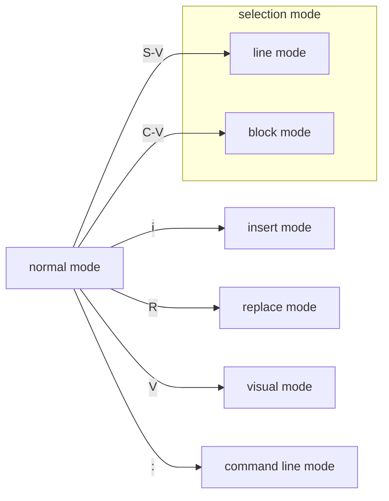

# VIM 的使用方法

## VIM 的模式切换

## 快捷键查询

### commnand line mode

命令|短键|含义|例子
:-:|:-:|:-:|:-:
:write|:w|保存|
:quit|:q|退出|
:help|:h|命令使用方法|:help :w
:split|:sp|窗口分屏|:sp fil2
:qall|:qa|全部退出|

### normal mode

命令|短键|含义|例子
:-:|:-:|:-:|:-:
hjkl|-|移动|-
w/b/e|-|向前/向后跳跃至单词首/尾|-
0/$|-|行首/行尾|-
C-D/U|-|上/下翻页|-
G/gg|-|文件最后/最开始|-
H/M/L|-|当前屏的最上/中间/下位置|-
find |f/F {char}|当前行查找|-
to/To|t/T {char} /|下一个字符前/上一个字符后/全文查找|-
o/O|-|向下/上新起一行|-
dd/de/dw/di{char}/da{char}|-|删除行/单词尾/下个单词首/删除符号内/删除带本符号的|-
cd/ce/cw|-|改写这部分内容|-
x|-|删除字符|-
r|-|改写某字符|-
u/C-R|-|撤销/重做|-
y/p|-|复制/粘贴|-
{num}+j|-|重复操作|-

> [video in youtube](https://www.youtube.com/watch?v=a6Q8Na575qc&t=60s&ab_channel=freeCodeCamp.org)